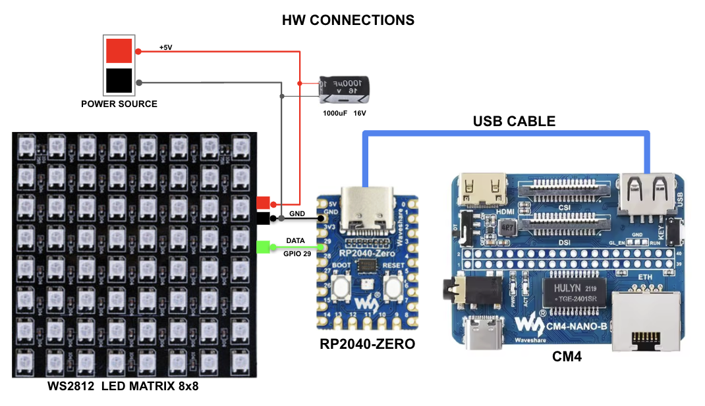
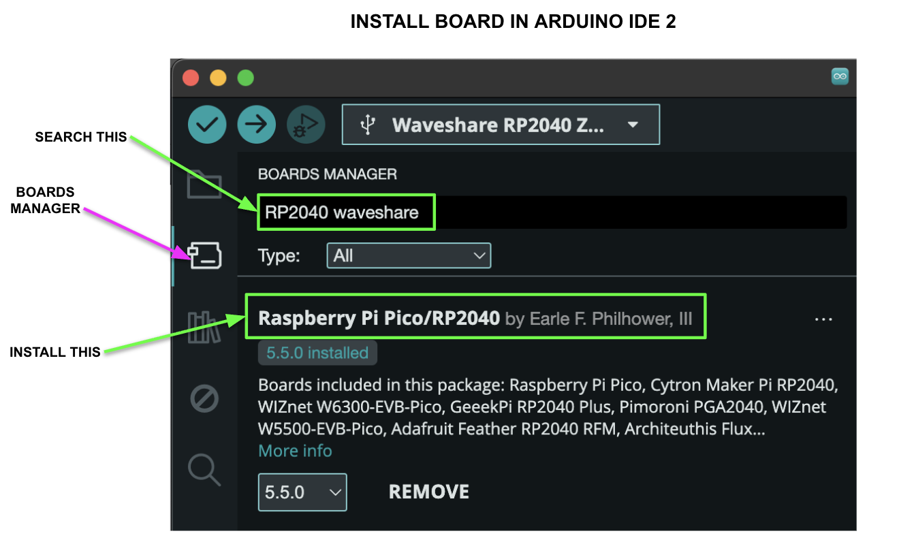
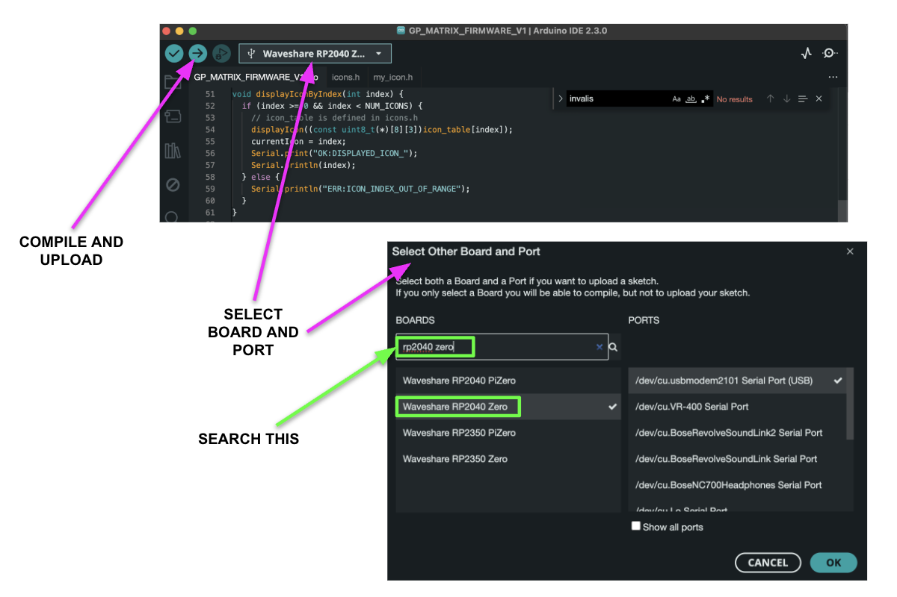
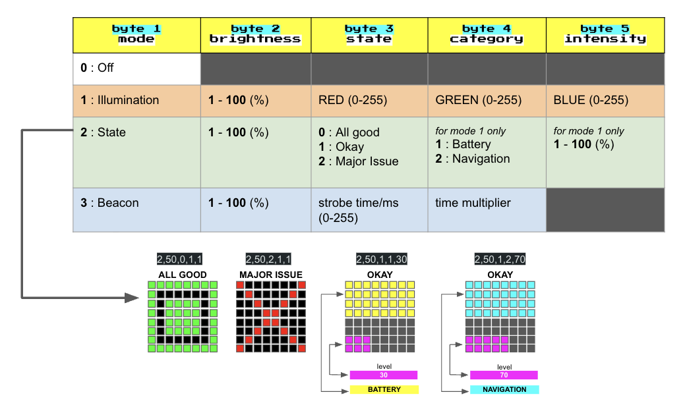
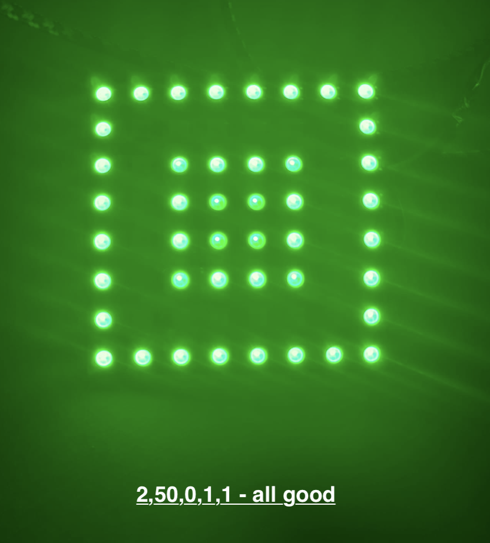
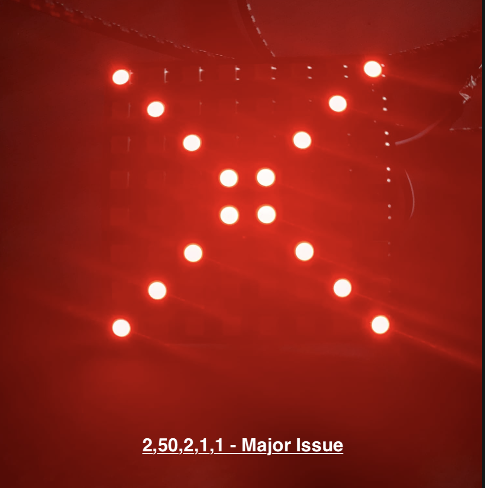
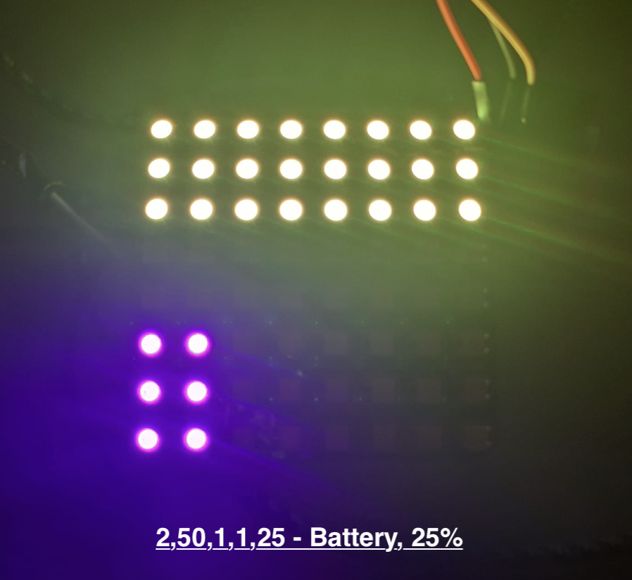
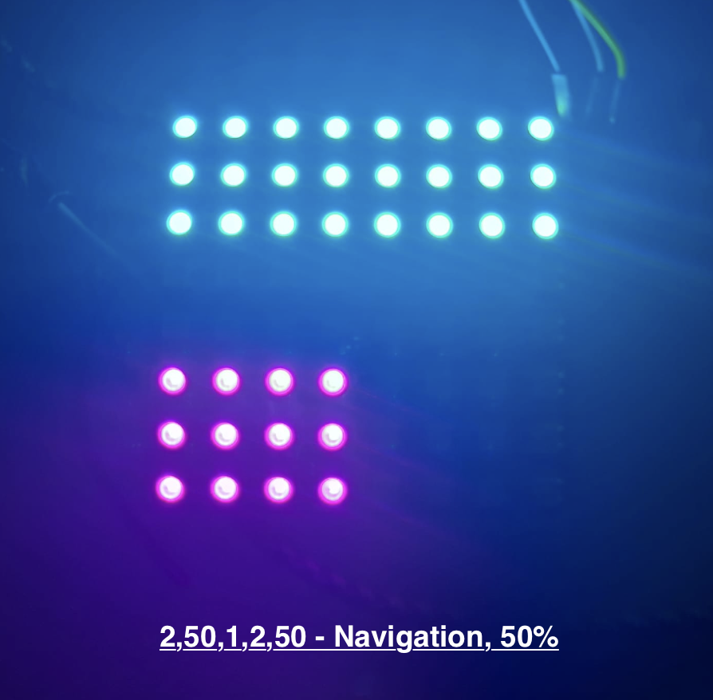
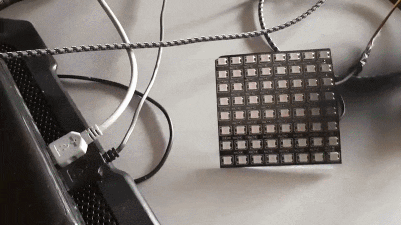
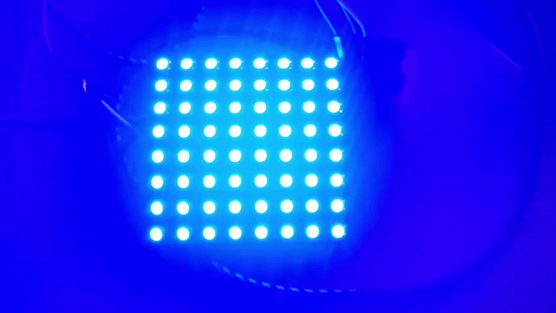

## RP2040 LED Matrix Controller 

A firmware project for RP2040-ZERO to control an 8x8 WS2812 LED matrix with serial command interface. Designed for (vehicle) status indication with multiple visualization modes.

Features
4 Operating Modes: **Off**, **Illumination**, **State Display**, **Beacon**

Serial Control: **Simple 5-byte command protocol over USB**

Visual Feedback: **Real-time LED matrix responses**

Diagnostic Tools: **Built-in RGB test pattern**

Hardware Requirements:  
- **RP2040-ZERO** (or any RP2040 board)  
- **8x8 WS2812 LED matrix**  
- **POWER SOURCE +5V**  
- **CAPACITOR 1000uF 16V**  
- **USB-C CABLE** for power/programming/communication

  

### ARDUINO BOARD/PORT CONFIGURATION

  
  

### Command Protocol
The device accepts 5-byte packets in the format:

[mode],[brightness],[byte3],[byte4],[byte5]

Send commands via serial communication at 115200 baud (comma-separated values, terminated with newline).

 
  

**Mode 0: OFF**
Turns all LEDs off.  
example: 0,0,0,0,0

**Mode 1: ILLUMINATION**
Full matrix illumination with any RGB color.

brightness: 0-100% (global brightness) 
byte3: Red value (0-255) 
byte4: Green value (0-255) 
byte5: Blue value (0-255) 

Examples:

1,50,255,0,0     - Red at 50% brightness 
1,80,0,255,0     - Green at 80% brightness 
1,100,0,0,255    - Blue at full brightness 
1,70,255,255,0   - Yellow at 70% brightness 

**Mode 2: STATE**  
Three-state display using pre-defined icons and progress bar.

brightness: 0-100% (global brightness)

byte3: State (0=Good, 1=Okay, 2=Issue)

byte4: Category (1=Battery, 2=Navigation)

byte5: Intensity percentage (1-100) for progress bar

State 0 - Good: 
Displays green square icon (icon_02_ok) 
example:  2,50,0,1,1

State 2 - Issue: 
Displays red X icon (icon_00_error) 
example: 2,50,2,1,1

State 1 - Okay: 
Split-screen with progress bar:
 
Rows 0-2: Solid color (Yellow for Battery, Cyan for Navigation)
 
Rows 3-4: Black separator
 
Rows 5-7: Purple progress bar filling left-to-right based on intensity%
  
Examples: 
2,50,1,1,25    - Battery, 25% progress (2 columns purple)
 
2,50,1,2,50    - Navigation, 50% progress (4 columns purple)
 
2,50,1,1,75    - Battery, 75% progress (6 columns purple)
 
2,50,1,2,100   - Navigation, 100% progress (all 8 columns purple)

**Mode 3: BEACON**  
Strobing red/blue with adjustable timing.

brightness: 0-100% (global brightness)

byte3: Base time in milliseconds (0-255)

byte4: Multiplier (1-255)

Strobe interval = baseTime × multiplier ms

 
Examples: 
3,80,100,2,0   - Strobe every 200ms
 
3,50,250,4,0    - Strobe every 1 second
 
3,90,10,10,0   - Fast strobe every 100ms
 

**SPECIAL COMMANDS**  

**HELP**     - Display command reference
 
**RGBTEST**  - Run RGB color test sequence
 

Icon Definitions
The project includes three built-in icons:

icon_00_error: Red X mark (State 2 - Issue)

icon_01_warning: Yellow warning triangle (reserved)

icon_02_ok: Green square (State 0 - Good)

Icons are stored as 8x8x3 RGB arrays in icons.h and displayed with serpentine layout compensation.

Serpentine Layout Handling
The code automatically compensates for WS2812 matrix serpentine wiring:

Even rows (from bottom): Display left-to-right

Odd rows (from bottom): Display right-to-left

This ensures that visual patterns appear correctly on the physical matrix.

Upon startup, the device flashes red/green/blue (power-on test). This provides visual confirmation that the matrix is working.

Enters standby mode and waits for first serial command.

**Serial Communication**  
Baud Rate: 115200
 
Format: ASCII comma-separated values
 
Termination: Newline character ('\n')
 
Response: OK/ERR messages with debug output
 
 
**Example serial session:**

RP2040 Matrix Display Ready
System in STANDBY mode
Type HELP for commands
2,50,1,1,30
DEBUG: Received raw string: '2,50,1,1,30'
DEBUG: Values valid, executing...
OK:STATE_OKAY_C1_P30

**Key Functions**  
modeOff(): Turn all LEDs off
 
modeIllumination(): Full matrix RGB illumination
 
modeState(): Icon and progress bar display
 
modeBeacon(): Adjustable strobe effect
 
displayIcon(): Render 8x8 icon with serpentine compensation
 
parseCommand(): Handle serial input
 
runRGBTest(): Diagnostic color test

**Future Customization**  

*Adding New Icons* 
Define new icon in icons.h as const uint8_t  
icon_name[8][8][3] 
Add to icon_table[] array 
Update NUM_ICONS define  

*Modifying Colors*  
Adjust RGB values in icon definitions or mode functions: 
 
Top colors (yellow/cyan) in modeState()
 
Progress bar color (purple) in modeState()
 
Beacon colors (red/blue) in modeBeacon()
 

**Troubleshooting**  
*No LEDs lighting up:*
 
Check data pin connection (GPIO 29)
 
Verify power supply (5V)
 
Run RGBTEST command
  
*Commands not working:*
 
Ensure baud rate is 115200
 
Use comma-separated format
 
Terminate with newline
  

**VISUAL EXAMPLES**  

   
   
   
   
matrix test: RGBTEST

 
 
beacon 1 second: 3,50,250,4,0 

 
 